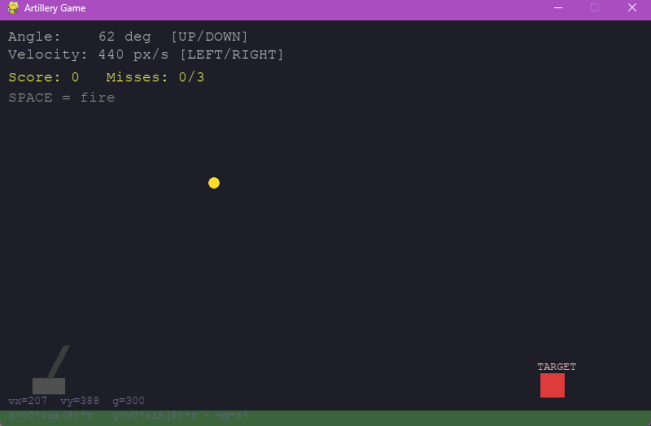
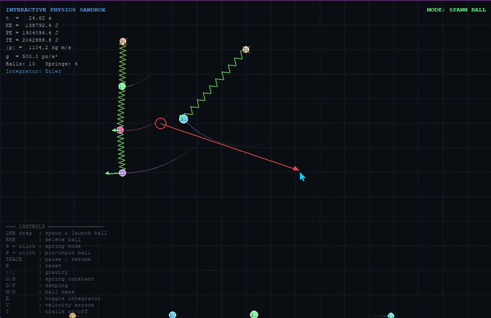

# 🎯 Artillery Physics Game

> A 2D projectile-motion game built in Python — physics concepts made playable.

---

## 📸 Screenshots

> **Add your screenshots here!**
> Replace the placeholders below by dragging your image files into this folder, then update the paths.

| Gameplay | 
|----------|
|  

---

## 🎬 Demo Video

> **Add your demo here!**
> Record a short screen capture (e.g. with OBS, QuickTime, or ShareX) and drop it here.


[

---

## 💡 What Is This?

This is a mini artillery game I built to **learn and apply projectile motion physics in code**.

You control a cannon — adjust the angle and launch velocity, then fire at a moving target. The ball follows real physics equations, and a dotted preview arc shows you where the shot will land before you fire.

The goal was simple: take the formulas from class and turn them into something you can actually *play*.

---

## ⚙️ Physics Behind It

The core of the game is the standard **kinematic equations for projectile motion**:

 x=v₀​cos(θ)⋅t
 y=v₀​sin(θ)⋅t−21​gt*2


| Symbol | Meaning |
|--------|---------|
| `v₀` | Initial velocity 
| `θ` | Launch angle 
| `g` | Gravitational acceleration 
| `t` | Time elapsed 

The velocity is split into two components each frame:

```
vx = v0 * cos(θ)        # horizontal — constant (no air resistance)
vy = v0 * sin(θ)        # vertical — changes due to gravity each frame
vy += g * dt            # gravity applied every tick
```

The **trajectory preview** works by simulating the full path before firing — running the same equations forward in time and drawing dots along the predicted arc.

---

## 🕹️ How to Play

### Controls

| Key | Action |
|-----|--------|
| `↑` / `↓` | Increase / decrease launch angle |
| `→` / `←` | Increase / decrease launch velocity |
| `SPACE` | Fire the cannon |
| `R` | Restart the game |

### Rules
- Hit the **moving red target** to score a point
- You get **3 misses** before game over
- Each new target moves at a random speed and direction
- Try to beat your high score!

---

## 🚀 Installation & Running

**Requirements:** Python 3.x + pygame

```bash
# 1. Install pygame
pip install pygame

# 2. Run the game
python artillery.py
```


## 🧠 What I Learned

- How to **decompose velocity into x/y components** using trigonometry
- How **gravity accumulates** over time in a simulation (`vy += g * dt`)
- How to **predict a trajectory** by running physics equations forward before committing to a shot
- How to build a **real-time game loop** at 60 FPS with `pygame`
- How small changes in angle or velocity produce **very different flight paths** — which is exactly what you feel when playing

---

## 🛠️ Built With

- **Python 3** — language
- **Pygame** — window, drawing, keyboard input, game loop
- **math** — `cos`, `sin`, `radians` for physics calculations
- **random** — target placement and movement direction


## 👤 Author

**Rahul Karwasara**
***NOTRAHUL78@GMAIL.COM*

